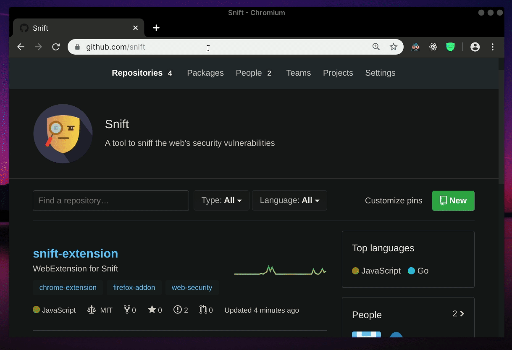

<div align="center">
	<br>
	<br>
	
	<br>
	<br>
	<br>
	<br>
</div>

> Browser extension that helps identify security issues on the sites you visit, anonymously.

[](https://app.codacy.com/app/snift/snift-extension?utm_source=github.com&utm_medium=referral&utm_content=snift/snift-extension&utm_campaign=Badge_Grade_Dashboard)

## Usage



Coming soon to the Chrome Webstore and to the Firefox Addons Store!

## Development

1. To install the required dependencies, run
    ```
      $ npm install
    ```

2. Based on the browser environment you want to run the extension, run the following command:

    ```
      $ npm run <browser>
    ```
    where `browser` is a placeholder denoting one of `chrome`, `firefox` or `opera`

    Once this command is run, a `dist` folder should be automatically created, wherein you would find the extension packaged for the target browser environment.
    You would use this folder to load the unpacked extension in the browser.

## Credits

Badge Icons made by [Icongeek26](https://www.flaticon.com/authors/icongeek26)
